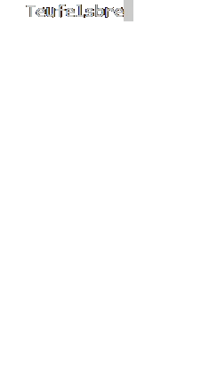
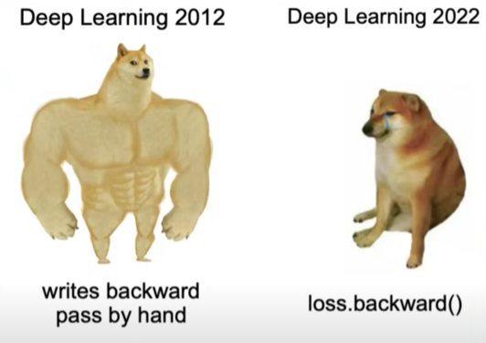

# machmehr

Based on [Andrej Karpathy’s makemore series](https://www.youtube.com/playlist?list=PLAqhIrjkxbuWI23v9cThsA9GvCAUhRvKZ).

## Overview

I implemented a simple, lightweight (~10M parameters) decoder-only Transformer in PyTorch. Currently it generates two kinds of outputs:

<table border=1>
  <tr>
    <td valign="top">
      <strong><i>Bavarian-sounding city/town names</i></strong>  
      
    </td>
    <td valign="top">
      <strong><i>Goethe-sounding text</i></strong>   
      
    </td>
  </tr>
</table>

## Why though? 

Good question. ~~I don't know~~. The point was to learn. I followed Karpathy’s **NN Zero to Hero** series and learned a great deal. 

### What I learned/things I did:

- Wrote NNs and MLPs from scratch. 
- Learned and implemented normalisation techniques like BatchNorm.
- Simulated stochastic gradient descent by hand in an MLP with normalisation layers. The goal was to get a better intuitive understanding of how backward passes work.  
- Understood how a decoder-only transformer works and implemented it from scratch, adhering to the [Attention Is All You Need](https://arxiv.org/abs/1706.03762) paper.

---

## Notes

- I am aware that using a transformer for the bavarian city name generation makes no real sense. Using simpler architectures like n-gram language models or RNNs would be more efficient and computationally make a lot more sense. 
- The goal here was rather to play around with transformers and get familiar with how they work, and also with PyTorch. 
- For the Goethe text, further improvements can definitely be made. I'll be looking into that in the future. 

---

## Acknowledgements

- [Andrej Karpathy](https://www.youtube.com/@karpathy) for the mind-blowingly good resources.  
- [Attention Is All You Need](https://arxiv.org/abs/1706.03762)